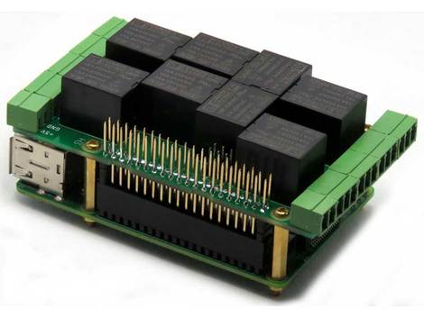

[](https://www.sequentmicrosystems.com)

# 8relind-rpi

[](https://www.sequentmicrosystems.com)

This is the command line and python functions to control the [8-RELAYS Stackable Card for Raspberry Pi](https://sequentmicrosystems.com/products/eight-relays-stackable-card-for-raspberry-pi) Ver. 4.If you use Ver 3.x download from [here](https://github.com/SequentMicrosystems/8relay-rpi). If you have Ver. 1-2 with screw-type connectors download from [here](https://github.com/SequentMicrosystems/relay8-rpi).

Don't forget to enable I2C communication:
```bash
~$ sudo raspi-config
```

## Usage

```bash
~$ git clone https://github.com/SequentMicrosystems/8relind-rpi.git
~$ cd 8relind-rpi/
~/8relind-rpi$ sudo make install
```

Now you can access all the functions of the relays board through the command "8relind". Use -h option for help:
```bash
~$ 8relind -h
```

If you clone the repository any update can be made with the following commands:

```bash
~$ cd 8relind-rpi/  
~/8relind-rpi$ git pull
~/8relind-rpi$ sudo make install
```  

### [Python library](https://github.com/SequentMicrosystems/8relind-rpi/tree/master/python)

### [Node-Red example based on "exec" node](https://github.com/SequentMicrosystems/8relind-rpi/tree/master/node-red)

### [Node-Red "8relind" node](https://github.com/SequentMicrosystems/8relind-rpi/tree/master/node-red-contrib-sm-8relind)

