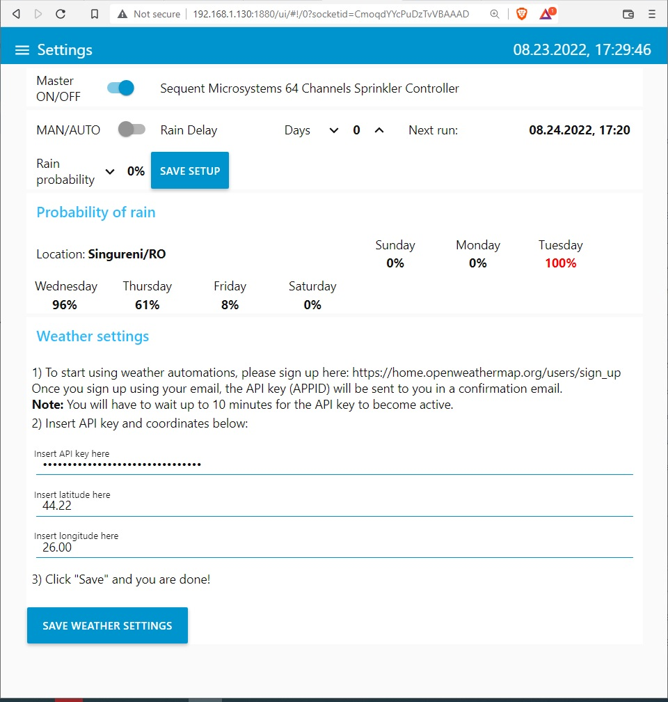

# Sprinklers 

This is an irrigation system created with Sequent Microsystems [Eight RELAYS 8-Layer Stackable HAT for Raspberry Pi](https://sequentmicrosystems.com/collections/industrial-automation/products/8-relays-stackable-card-for-raspberry-pi)

Open in new tab  <a href="https://sequentmicrosystems.com/collections/industrial-automation/products/8-relays-stackable-card-for-raspberry-pi" target="_blank" rel="noopener">Eight RELAYS 8-Layer Stackable HAT for Raspberry Pi</a>

## Installing the software

* Install NodeRed folloing the instructions from [here](https://help.ubidots.com/en/articles/1958375-how-to-install-node-red-in-raspberry-pi).

* Enable I2C communication running ```sudo raspi-config```

* Connect up to 8 [cards](https://sequentmicrosystems.com/collections/industrial-automation/products/8-relays-stackable-card-for-raspberry-pi) to your raspberry, ech with different stack level jumper settings.  

* Install the node for Eight RELAYS hat by open NodeRED interface in a browser: Go to Menu > Manage pallete > Install and search for node-red-contrib-sm-8relind, install the node and restart the NodeRED

* Import the Sprinkler controller flow: Go to Menu > Import > select a file to import. Load the provided [flows.json](https://github.com/SequentMicrosystems/8relind-rpi/blob/main/node-red/Sprinklers/flows.json) file and click Import button.


* Click on the top rigt ```Deploy``` button.

* Go to the dashboard and select  the Settings menu


* Setup the weather and operating mode:


* Enable each channel per day of the week from the Stations tab. The software detects how many card you connected and create a page for each card.


